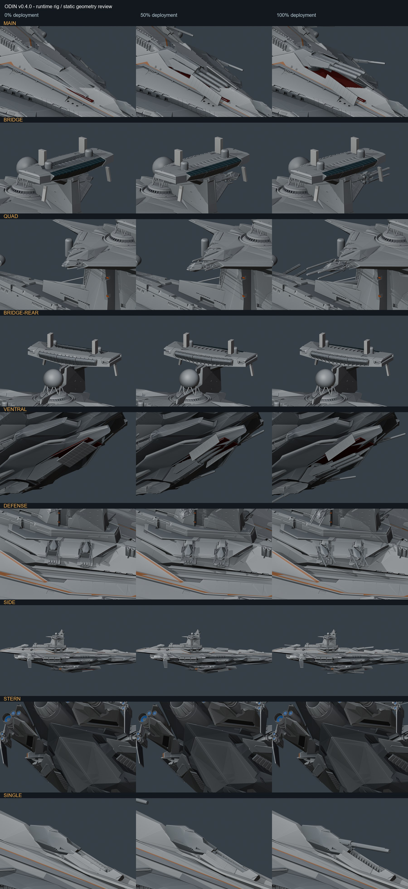

# Articulation review — v0.4.0

`articulation-stages.jpg` shows deployment at 0%, 50% and 100% from nine views. The poses come from `createOdinRig()` in the Nuxt source, evaluated against the exported GLB hierarchy and applied to the separate Blender copy for static inspection. Workbench lighting exposes geometry; these are not final PBR web screenshots. No Blender animation is exported.

Rows: dorsal main battery, front bridge armor, bridge quad close-up, rear bridge armor, ventral battery, deck defense, side profile, original aft door, bow single battery. The 25% and 75% frames remain local inspection files.

```bash
node tools/review_rig_poses.mjs
blender -b assets/blender/odin_articulated_v0.4.0.blend --python tools/render_rig_review.py
```

## Reference and reconstruction

- The [RSI Odin page](https://robertsspaceindustries.com/en/comm-link/transmission/21133-Anvil-Odin) main-battery clip (`ns6umeu6gb7w5`, first four seconds) shows covers opening along two longitudinal hinges. The four leaf banks now sit ahead of the original housings and fold out/down. Original barrel shrouds separate before elevation; the two outside tubes telescope slightly while the center tube stays with the cradle.
- The same page's quad clip (`meqm0flrf1683`) shows parallel gun axes during deployment. The previous 180-degree barrel flip is removed. The gunner pod travels only eight source units; the individual gun assemblies slide out after it. Slow aiming starts only after deployment.
- Original single-battery vented armor skins are separated from the hull for three paired shutters. Their bearing/link geometry remains in the bay. The cover leaves clear before gun elevation, and close after retraction.
- [SCL at 48:33](https://www.youtube.com/watch?v=CFoQp6wRjPo&t=2913s) shows the bridge blast shields. The front skirt was still fused into the hull in earlier exports, so animating the roof parts did not expose the bridge. That original skirt is now separated and folds/slides over the roof; rear louvers retain their own hinges.
- [SCL at 51:48](https://www.youtube.com/watch?v=CFoQp6wRjPo&t=3108s) helps identify the aft closure. The misplaced replacement is removed. Hidden original objects `holo.025` and `holo.026` are recovered with their original world transforms; their door/frame edges match without a guessed placement.
- Twin mounts use the inverse of their source orientation before applying a small upward aim and varied headings. Main and single-barrel guns do not idle-scan.

This is a reconstruction of visible exterior behavior from a partial model and public footage, not the unpublished CIG production rig. Covers, timing and unseen linkages remain fan-art approximations.

The original file is unchanged. The versioned Blender copy has no animation actions; both GLBs have zero clips. Tests check cover-clearance order, stationary hatch hinges, constant quad barrel orientation through deployment, short pod travel, independent telescopic tubes, bridge movement, fixed main/single aim, reversible poses, pause intent, camera continuity and exhaust interlocks. Browser QA covers the PC high-quality renderer, free exploration without reset, mode switching and visible NAV exhaust.


