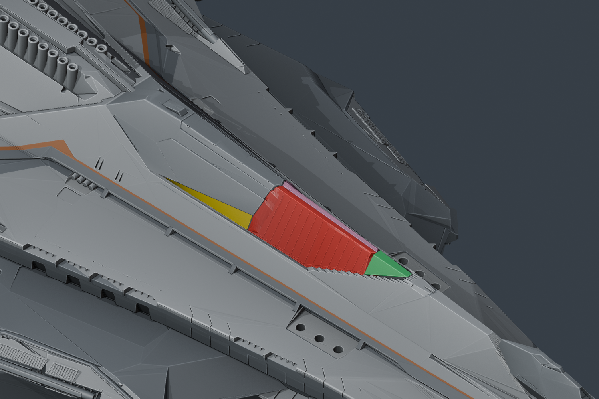
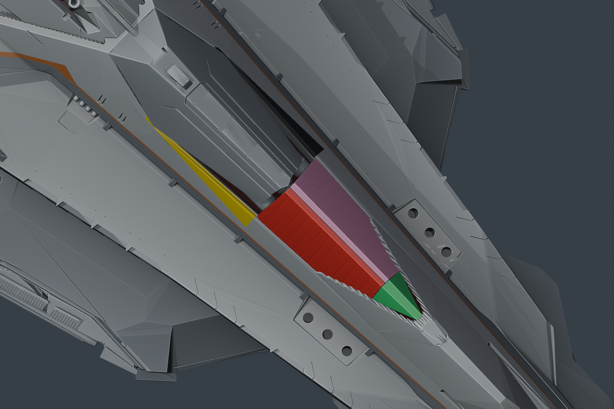
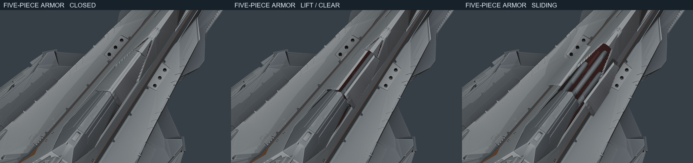
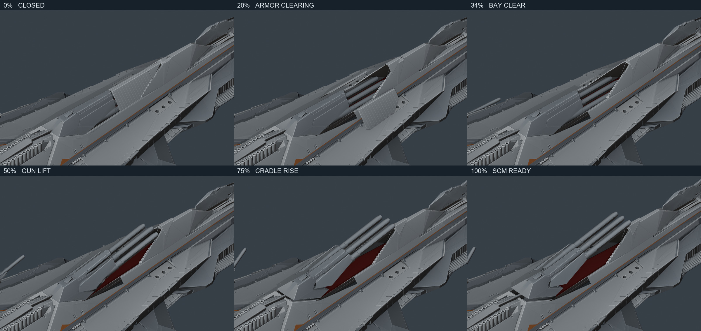

# Articulation review

当前候选：[v0.11.3 侧舷四座炮塔装甲贴合与接触边转轴](v0.11.3/README.md)，使用 localhost 的 `/?review=secondary` 实时预览。

## Archived review — v0.7.0

`main-armor-parts.png` identifies the five pieces: red and pink are the two long side skins, black and yellow are the independent gap fillers below the rotating gun shrouds, and green is the short wedge at their forward end. The two aft pieces now occupy the missing region marked in the user's close-up, rather than being cut out of the neighboring hull surface. Both main-battery hull meshes are restored from v0.5, and the farther foredeck stays fixed. Review colors are not saved to the asset.

`main-battery-sequence.jpg` shows 0%, 20%, 34%, 50%, 75% and 100% deployment. `main-armor-guide.jpg` isolates the first clearance stages. `articulation-stages.jpg` shows nine views at 0%, 50% and 100%. These are actual `createOdinRig()` poses evaluated against the exported GLB hierarchy and applied to the separate Blender copy. Workbench lighting exposes geometry; these are not final PBR web screenshots. No Blender animation is exported.

Rows: dorsal main battery, front bridge armor, bridge quad close-up, rear bridge armor, ventral battery, deck defense, side profile, original aft door and bow single battery.

```bash
node tools/review_rig_poses.mjs
blender -b assets/blender/odin_articulated_v0.7.0.blend --python tools/check_main_clearance.py
blender -b assets/blender/odin_articulated_v0.7.0.blend --python tools/check_closed_armor.py
blender -b --python tools/verify_fixed_hull.py
blender -b assets/blender/odin_articulated_v0.7.0.blend --python tools/render_rig_review.py
blender -b assets/blender/odin_articulated_v0.7.0.blend --python tools/render_armor_parts.py
python tools/make_rig_review_sheet.py
```

## Reference and reconstruction

- The [RSI Odin page](https://robertsspaceindustries.com/en/comm-link/transmission/21133-Anvil-Odin) main-battery clip (`ns6umeu6gb7w5`, 0–3.0 seconds) shows the long ribbed armor translating without pivoting. The v0.7 main leaves are reconstructed from the actual closed shroud front profile and fixed hull inner-lip coordinates, recorded in `tools/main_armor_v07_boundaries.json`. The dorsal outer seam follows the source sawtooth steps; the ventral seam follows its separately measured faceted lip. Neither is replaced by a rectangular outline. The original serrated deck lip stays fixed. The short fore-end cap lifts over its seal, then slides toward the bow.
- Main-leaf guide travel is reduced from v0.6's 16.4 outboard / 23.2 inward to 10.5 / 17.6 for the dorsal bank, and from 16.4 / 23 to 10 / 16.1 for the ventral bank. These are asset source-coordinate units. The rigid plates keep their orientation, travel outboard to clear the bores, then descend below the lip. The revised endpoints reduce the excessive outward/downward excursion while keeping the visible gun path clear.
- All five covers are parked by 34% deployment. Gun leveling starts at 36%, followed by barrel and cradle rise. The outer two tubes have a full 16-unit telescope stroke along their measured bore axes. Their fully deployed SCM endpoints are unchanged; the stowed endpoints move farther into the sleeves to clear the armor. Stowing evaluates the same paths in reverse, nesting the tubes and lowering the gun before armor closes. The full transition lasts 6.5 seconds. Original recessed hull faces replace the earlier rectangular bay floor and rails.
- The black/yellow aft pieces are independent thin gap fillers between the rotating shroud toes and the fixed hull inner lips. Version 0.7 restores the full v0.5 `holo.001` / `holo.013` meshes before adding them; it removes zero fixed-hull faces. This supersedes v0.6's incorrect extraction of adjacent hull surfaces. The filler joints translate down/out before the gun rises and remain attached to the hull. There are five covers per bank, ten total. Earlier versioned assets and reconstruction scripts remain available for provenance.
- The same page's quad clip (`meqm0flrf1683`) shows parallel gun axes during deployment. The previous 180-degree barrel flip is removed. The gunner pod travels only eight source units; the individual gun assemblies slide out after it. Slow aiming starts only after deployment.
- Original single-battery vented armor skins are separated from the hull for three paired shutters. Their bearing/link geometry remains in the bay. The cover leaves clear before gun elevation, and close after retraction.
- [SCL at 48:33](https://www.youtube.com/watch?v=CFoQp6wRjPo&t=2913s) shows the bridge blast shields. The front skirt was still fused into the hull in earlier exports, so animating the roof parts did not expose the bridge. That original skirt is now separated and folds/slides over the roof; rear louvers retain their own hinges.
- [SCL at 51:48](https://www.youtube.com/watch?v=CFoQp6wRjPo&t=3108s) helps identify the aft closure. The misplaced replacement is removed. Hidden original objects `holo.025` and `holo.026` are recovered with their original world transforms; their door/frame edges match without a guessed placement.
- Twin mounts use the inverse of their source orientation before applying a small upward aim and varied headings. Main and single-barrel guns do not idle-scan.

The [SCL video at 5:48](https://www.youtube.com/watch?v=CFoQp6wRjPo&t=348s) discusses the Odin's armament, but the linked timestamp does not provide the close-up deployment cycle. The RSI page's main-battery clip provides that fixed-camera view, including the closing sequence at roughly 5.3–7.4 seconds. Exact internal guides remain unavailable, so the sliding distance and hidden deck cassette are fan-art estimates measured against the visible plate motion.

`main-clearance.json` records triangle-surface intersection checks at 101 actual JS deployment poses. It tests all ten armor pieces against their bank's barrels, shrouds and mounts, plus every pair of armor pieces in each bank: 30 assembly pairs per pose. The report includes the result, asset hash and rig-code hash. This is sampled exterior mesh clearance, not a continuous collision proof or validation of unavailable internal ship structure. Closing retraces the same poses.

`hull-preservation-v07.json` verifies exact per-index vertex coordinates, polygon winding/topology, edge topology and object transforms against v0.5. Both fixed hull meshes are identical under those comparisons; only recessed-floor material assignments change. `closed-armor-hull-clearance.json` records separate closed-pose checks, which found zero triangle intersections between all ten armor pieces and the corresponding fixed hull. The ventral leaf edges and the cap tips include clearance for the original lip rather than hiding the lip under intersecting armor. These closed-pose results do not assert that a retracting plate avoids all hidden internal hull surfaces while entering its storage space.

The original file is unchanged. The versioned Blender copy has no animation actions; both GLBs must have zero clips. The test suite covers clearance before gun rise, lift-before-slide cap travel, rigid reversible side plates, the 16-unit tube stroke with a stable SCM endpoint, constant quad barrel orientation, short pod travel, bridge movement, pause intent, camera continuity and exhaust interlocks. The required release checks are `npm test`, `npm run verify:asset`, `npm run generate` and PC browser review of the changed articulation. This reconstruction follows public exterior references and measured model seams; it does not claim to reproduce CIG's unavailable production rig or internal mechanism.










## Candidate validation

20 tests passed; both GLBs passed the asset verifier with zero animation clips, and Nuxt generated successfully. PC browser review loaded the high-detail GLB with 132 joints, inspected NAV closed seams at close range, switched to SCM and back, and confirmed that explicit film pause remained after leaving exploration and moving the timeline. The browser console reported no errors or warnings. The nine-view static review also includes secondary guns, PDC/bridge quads, bridge armor and the aft door.
