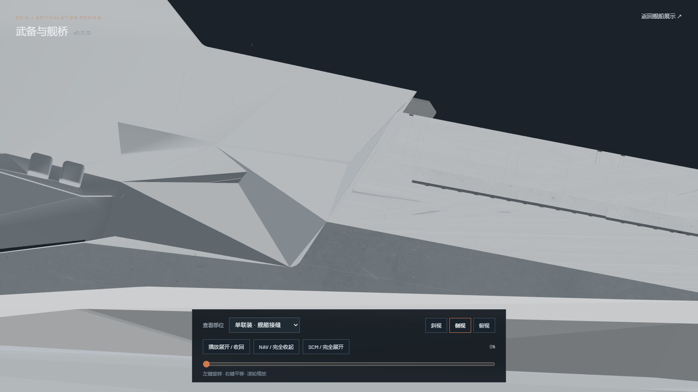
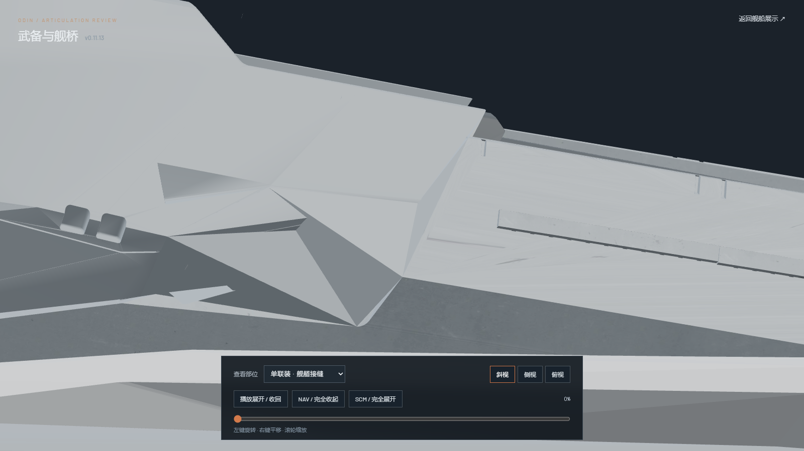
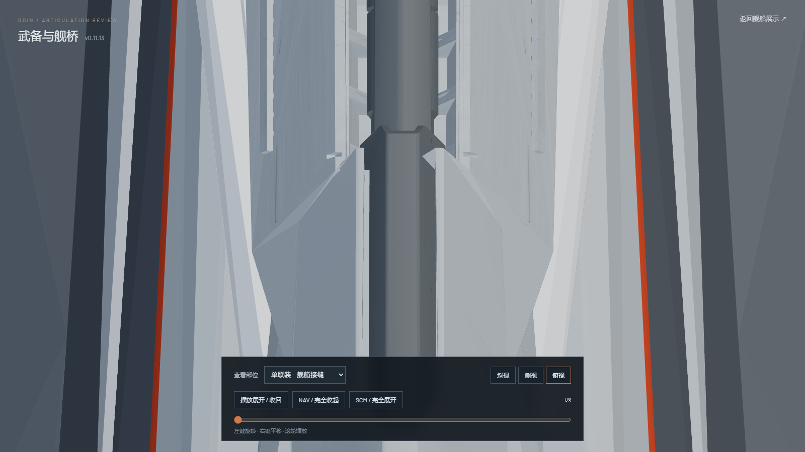
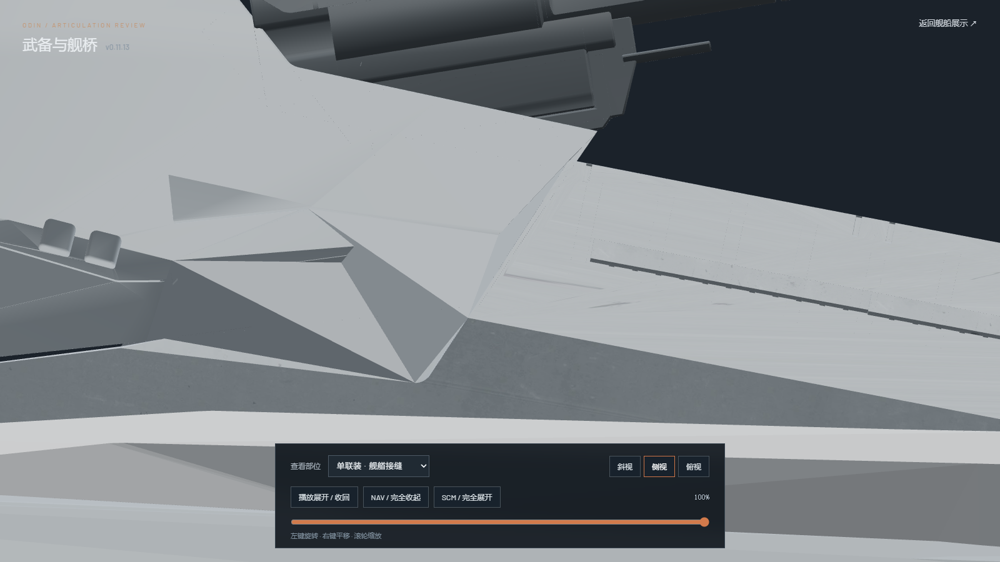

# Bow turret receiver seam review — v0.11.13

The exposed diagonal opening between the restored bow turret housing and the rigid bow receiver is covered on both sides by separate stationary fairing geometry. The fairing follows the housing's outer silhouette and the receiver shoulder. No source housing or receiver vertices, receiver placement, or bow/stern gun articulation were changed from v0.11.12.

The browser review has a dedicated `单联装 · 舰艏接缝` camera in `/?review=secondary`. These are direct 1600 × 900 browser captures from the exported high-detail GLB:

| Pose | Side | Oblique / top |
| --- | --- | --- |
| Stowed |  |  |
| Top |  | |
| Deployed |  | |

Blender renders also checked both port and starboard at stowed, half-deployed, and deployed positions. Mesh-coordinate and polygon digests for `odin.003` and `Axial_Bow_SourceReceiver_Skin`, plus the receiver's local transform, match v0.11.12 exactly. `npm test` (36/36), `npm run verify:asset` (both GLBs valid, zero animation clips), and `npm run generate` passed. Browser spot checks also covered the stern single, a flank single, an aft twin, bridge quad/PDC, main armor, and bridge.
