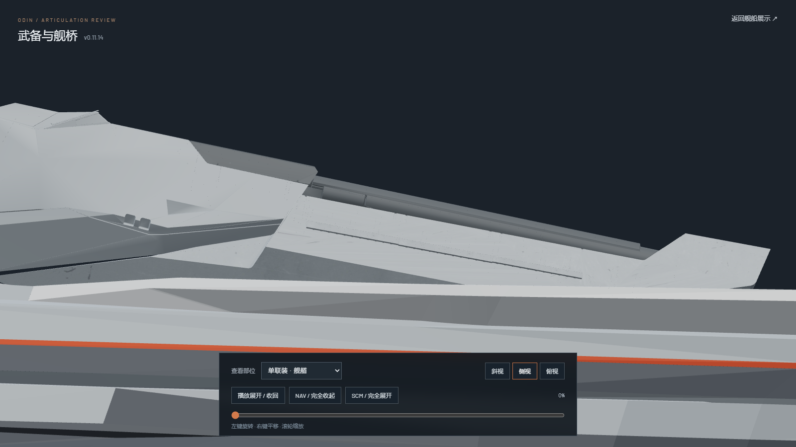
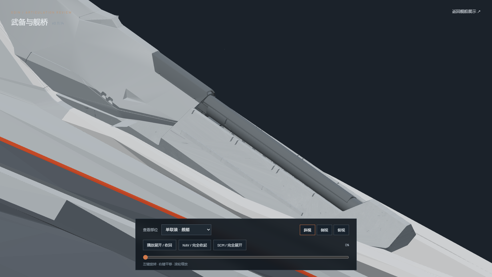
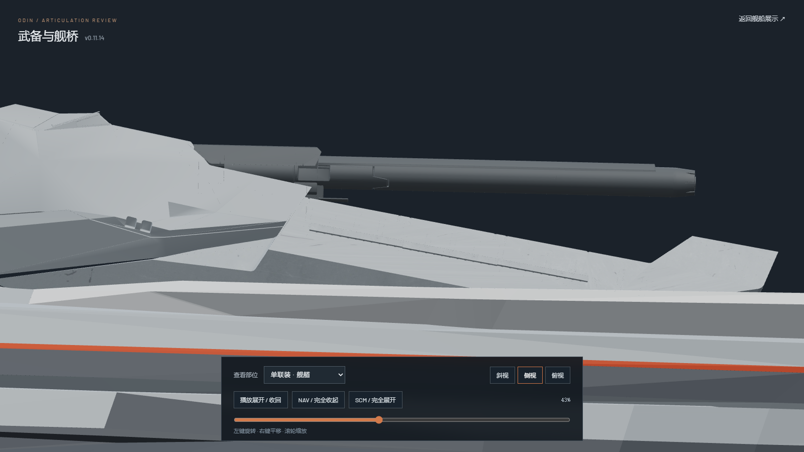
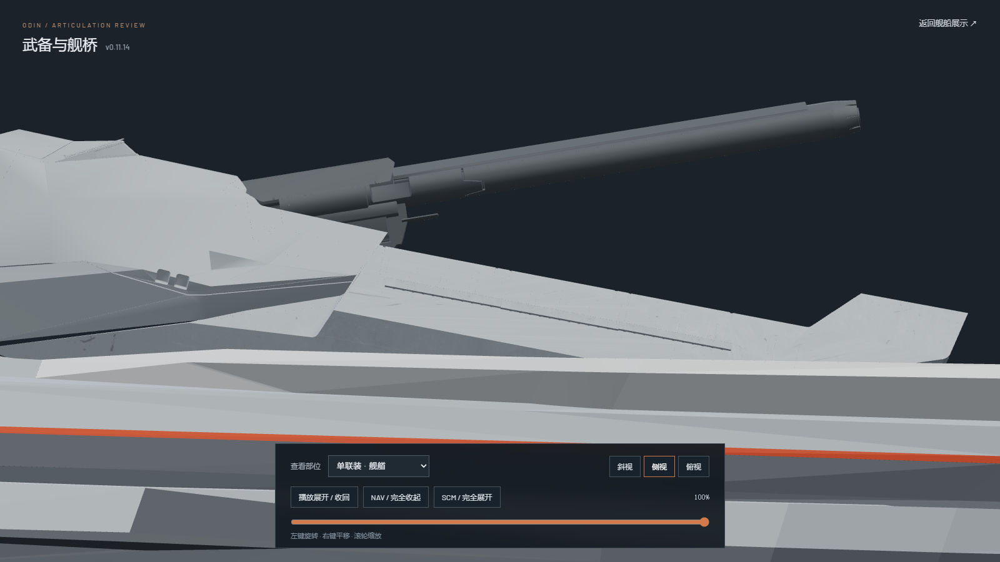
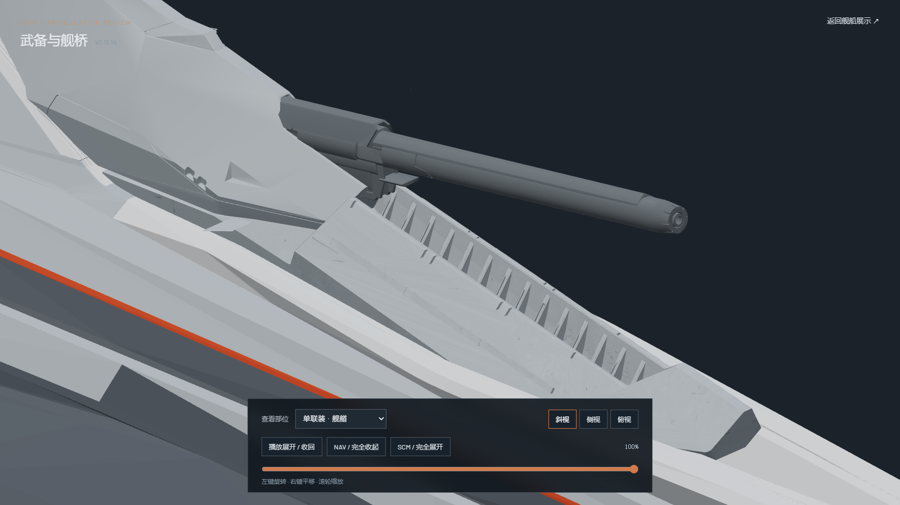

# Bow source geometry and motion review

The bow receiver retains the accepted rigid v0.11.12 offset `(0, 3.45, 0.55)` in Blender model coordinates. This revision starts from `odin_articulated_v0.11.12.blend`, so the two v0.11.13 shoulder skins are absent; no bow gun, housing, receiver, or hull mesh is reshaped. The source `odin.blend` is read only and the exported GLBs contain zero animation clips.

The web rig now applies `odin.002`'s original frame 30–56 location and XYZ Euler curves as a rigid transform of its frame-30 mesh. The [Blender source samples](../../../tests/fixtures/bow-source-motion-v01114.json) give world positions for two actual gun vertices at five frames. The rig test compares both positions with those samples to within `0.00001` web units. The stern and other turrets keep their previous animation branches.

These screenshots were captured from the generated browser preview at `/?review=secondary`:

| Bow pose | Side | Oblique |
| --- | --- | --- |
| Closed, 0% |  |  |
| Original motion, 43% |  | — |
| Deployed, 100% |  |  |

The receiver-to-housing boundary is left as it exists in the restored source geometry; this revision does not disguise it with another added panel.
