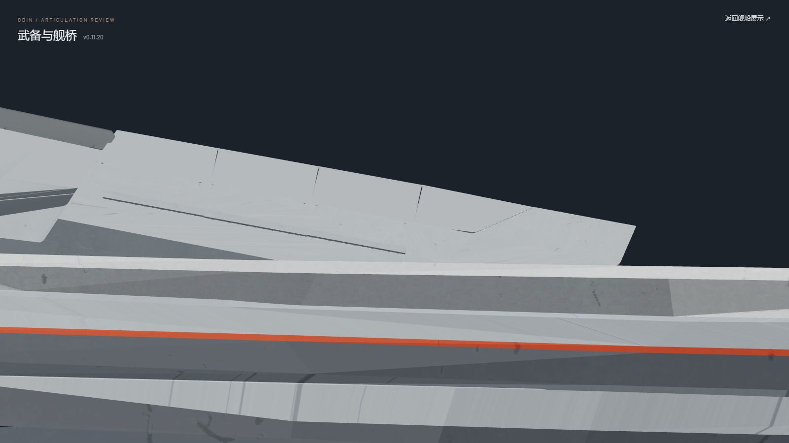
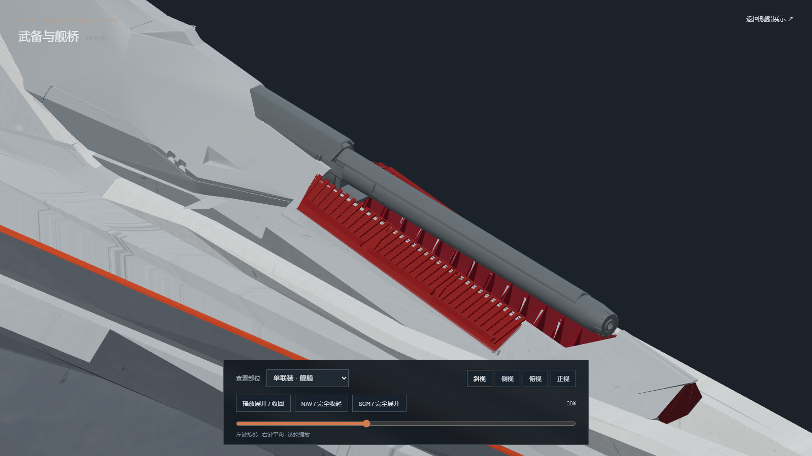
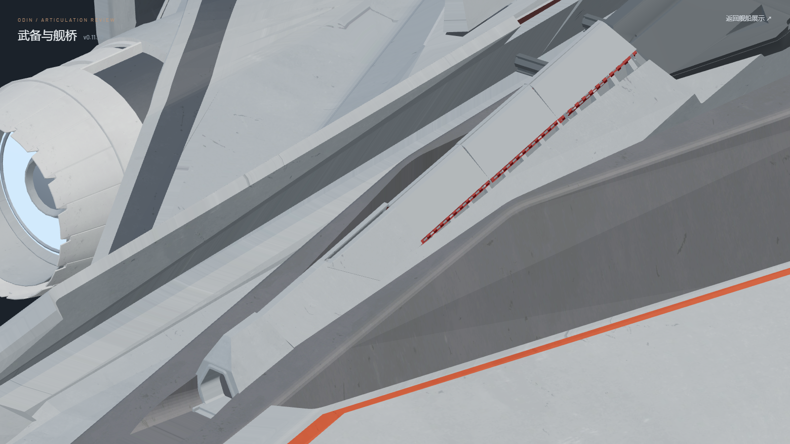
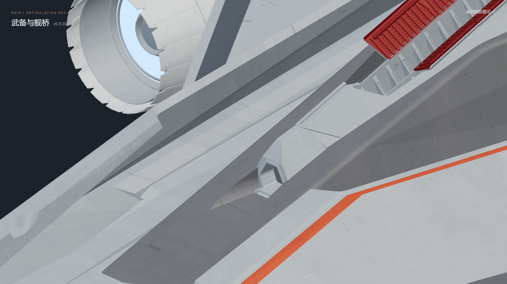

# v0.11.20 — front plate fit and original stern support

The bow's foremost plate previously extended past the raised end of the bore receiver. Its leading end now follows the receiver's measured diagonal edge, including the crown. The six vertices forming each half's accepted rear seam are unchanged. The plate's closed length is 9.52 source units instead of 12.03, and the receiver itself has not been moved or reshaped in this revision.

The stern's foremost moving armor is the exact 66-face `single_behind_1st_armor` shell in the supplied `D:\Odin\blender_test\odin_with_anime.blend`. Eight fixed hull faces underneath that shell were missing from the prior asset. Those eight faces are restored at their original coordinates and remain on the fixed hull. The moving plate and its motion remain unchanged.

The revised editable model is [odin_articulated_v0.11.20.blend](../../../assets/blender/odin_articulated_v0.11.20.blend). Both original reference files are read only. Geometry, materials, textures and static joints are exported; both GLBs contain zero animation clips.

## Browser review

Screenshots use the desktop Three.js review scene at 1600 × 900. The detail views hide the controls temporarily so the restored structure is visible.

Bow, fully stowed: the first plate ends at the receiver's diagonal lip.

Bow, 38% deployed: the first plate is clear of the original barrel motion.

Stern, fully stowed: the source plate and fixed hull beneath it.

Stern, fully deployed: the source plate returns to its original open position.

## Verification

- `npm test`: 45 tests passed, including bow frames 30–56 and stern frames 11–37 against original barrel motion samples.
- `npm run verify:asset`: both desktop and light GLBs passed; zero animation clips.
- `npm run generate`: passed.
- [Source geometry audit](source-fit.json): eight fixed support faces match the reference; all other 897 meshes and 187 static joints retain their prior geometry and transforms. The two shortened bow skins retain all six rear seam vertices per half exactly.
- Browser review covered stowed, intermediate and deployed bow/stern poses, including 34%, 36%, 38% and 40% bow barrel lift; side and keel batteries; defense twins; bridge/PDC quad mounts; fixed bridge armor; and upper/lower main batteries.

Additional views: [bow stowed side](bow-closed-side.png), [stern stowed side](stern-closed-side.png), [stern deployed](stern-deployed-oblique.png), [flank](flank-deployed-oblique.png), [aft twin](aft-twin-closed-oblique.png), [bridge quad](bridge-quad-closed-oblique.png), [bridge armor](bridge-armor-fixed.png), [upper main](main-upper-deployed-oblique.png), [lower main](main-lower-deployed-oblique.png).
