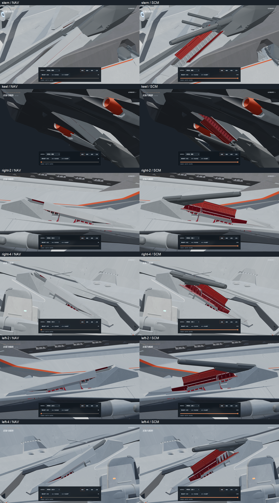
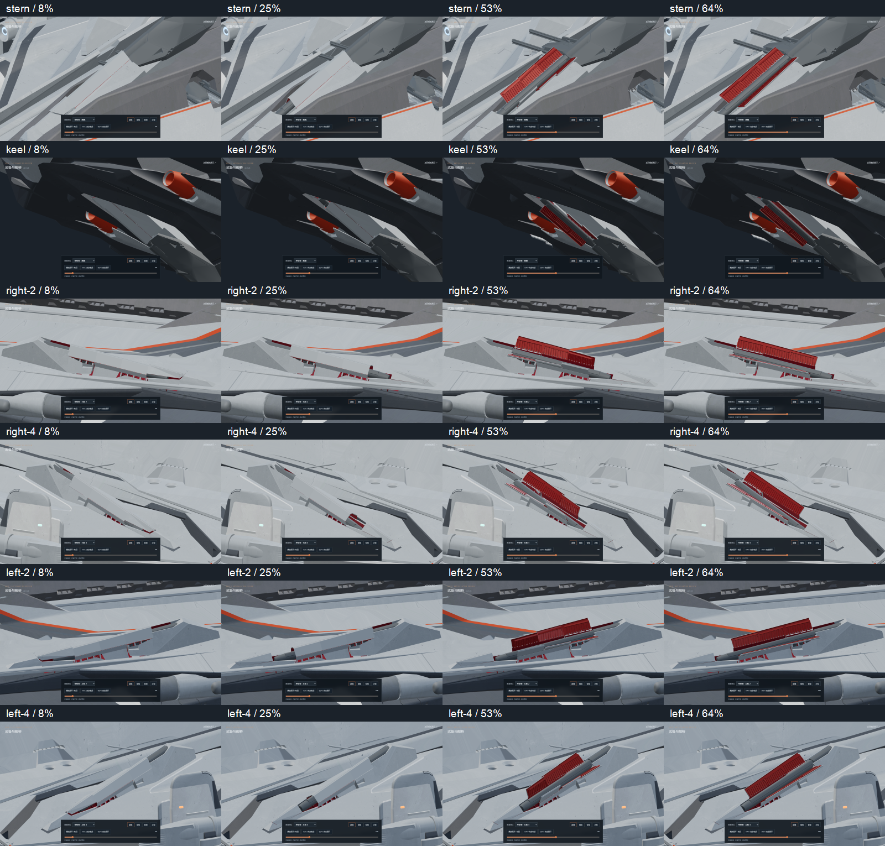
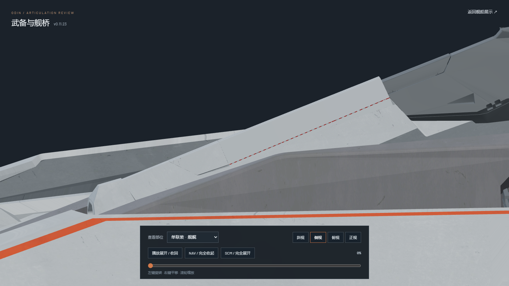
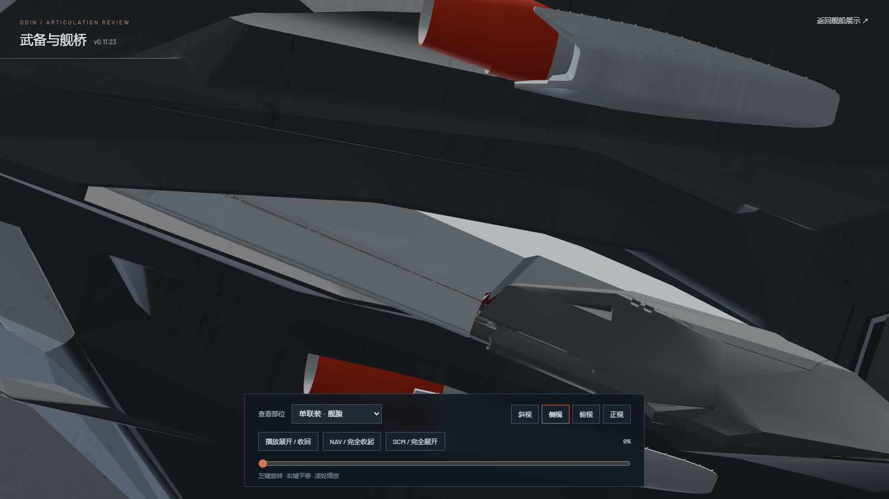
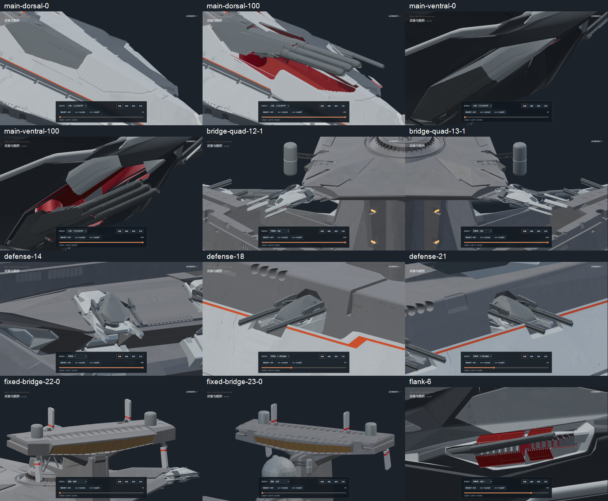

# v0.11.23-rc.1 — axial crown alignment and flank singles 2/4

The stern and keel nose crowns previously changed slope where they met the
folding covers. Their crowns now continue the same line from the accepted
breech height to the original fixed front receiver. The fixed nose supports,
receiver corners, source nose topology and rolled edge detail remain intact.

Port/starboard side singles 2 and 4 now use the accepted flank vented meshes
and opaque fitted skins, replacing 336 legacy handmade cover meshes. Each
bay has six folding leaves and its own original nose shell. The nose lifts
0.6 model units during 0–8%, advances during 10–25%, then the leaves unfold
95 degrees in the stern/keel sequence. The unchanged barrel action begins
after they clear. Uniform contact rails and gray exterior/red interior fixed
slot lips meet the leaves; the cap's full leading diagonal meets the original
receiver. Inward cap surfaces are red; outward faces retain gray paint.

Only 24 side cover contact joints are repositioned. All other 163 joint
matrices, 75 gun metadata records and 465 existing mesh/material hashes are
unchanged. In particular, the original bow/stern source barrel actions and
the keel's fixed former 14% assembly position are preserved.

Editable geometry: [odin_articulated_v0.11.23.blend](../../../assets/blender/odin_articulated_v0.11.23.blend).
The original `odin.blend` is unchanged; the animation reference is read only.
Both current source fingerprints are recorded in the saved geometry audit.
GLBs contain geometry/materials/static joints and **zero animation clips**;
Nuxt/Three.js still authors every motion.

Validation:

- `npm test`: 46 passing, including original barrel keyframe fixtures, exact
  keel seat, reversible rigid articulation and the four new seven-cover
  sequences.
- `npm run verify:asset`: high and lite GLBs pass.
- `npm run generate`: static site generation passes.
- [Saved geometry audit](geometry-check.json): maximum fitted crown/edge
  deviation below 0.00003 model units; original receiver seam is 0.02.
- [Browser checks](browser-check.json): 24 endpoint views, 60 forward/reverse
  motion poses, 33 other armament poses and two axial crown details at
  1600×900; no console errors. Main batteries, all secondary mounts, defense
  guns, bridge quad/PDC arms and fixed bridge armor were reviewed.
- Paused review rendering remains at 98 frames over a 600 ms idle interval;
  playing resumes rendering, and explicit pause survives view changes.
  Every automated checking browser was closed. Existing in-app preview tabs
  could not be closed because their control connection failed.

