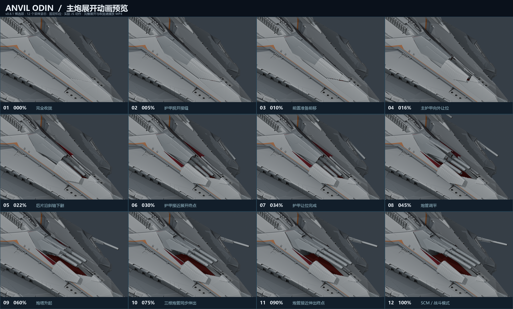

# v0.8.1 主炮护甲接缝与动作预览

这是一份供用户决定是否采用的动画候选预览。先观看展开与收拢，再决定网站采用的版本；本目录中的视频不是网站最终材质效果。

[播放主炮展开／收拢动画](main-battery-preview.mp4)



## 本次调整

- 两块主护甲的后沿取自原炮塔可旋转护罩的实际轮廓；主板前沿与前盖使用共享截面，统一脊线、斜面和接缝高度。
- 主板外缘和前盖按固定船壳开口及锯齿边界贴合；后侧小护甲填补护罩下方空缺，保留固定船壳。
- 保留三根炮管同步伸缩、主板较短的外移／下移行程，以及后侧护甲沿斜置轴向外下翻约 130°的动作。
- 后侧护甲在展开进度 14% 后开始外翻，先让主板脱开接缝；护甲让位完成后再调平和升起主炮。
- 护甲外侧保持现有灰色，内侧为深红色。原始 `odin.blend` 未修改；可编辑候选模型另存为 `assets/blender/odin_articulated_v0.8.1.blend`。

## 预览如何生成

视频从实际 `public/models/odin.glb` 静态节点层级读取关节，再调用 `app/lib/odin-rig.ts` 计算 101 个姿态。Blender 仅用于把这些 JS 姿态渲染为图片，不编写或导出动画片段，也不保存预览中的临时姿态。

固定机位的 Workbench 灰模预览用于审查接缝、机构行程和动作先后。它包含内外表面的基础颜色，但不是 Nuxt 页面最终的光照、贴图和材质呈现。十二张图按关键机构阶段选取，时间间隔不同；MP4 包含完整的约 6.5 秒展开、0.8 秒停留、约 6.5 秒收拢和0.8 秒停留。

[动画与源文件校验记录](animation-preview.json) 包含 GLB、JS rig、候选 Blend、姿态和视频的校验值。编码结束后会完整解码视频，检查输出帧数。

## 复现预览

在项目根目录使用 Node 24、Blender，以及安装了 Pillow 的 Python。编码工具可通过 `--ffmpeg` 参数、`FFMPEG_BINARY` 环境变量或系统 `PATH` 查找 ffmpeg。

```sh
node tools/review_animation_poses.mjs --version 0.8.1
blender -b assets/blender/odin_articulated_v0.8.1.blend --python-exit-code 1 --python tools/render_animation_preview.py -- --version 0.8.1 --width 960 --height 640
python tools/encode_animation_preview.py --version 0.8.1 --ffmpeg /path/to/ffmpeg
python tools/make_animation_sequence.py --version 0.8.1
```

101 张中间图片存放在忽略提交的 `work/preview-v0.8.1/frames/`；MP4、十二帧序列图和校验记录存放在本目录。可选 `--gif` 仅在 work 目录生成循环 GIF。

## 验证状态

候选模型保留供审核，以下检查通过：

- `npm test`（20 项）、`npm run verify:asset`、`npm run generate`。高／低两份 GLB 均不包含动画片段。
- 101 个实际 JS 姿态的护甲／炮塔、护甲之间及护甲／固定船壳相交检测均为零，报告见 `main-clearance.json` 和 `hull-sweep.json`。
- 固定船壳坐标、拓扑和变换保持一致，见 `hull-preservation.json`。
- 浏览器复查和其他机构核对记录见 `browser-review.json`、`unchanged-systems.json`。

三角网格抽样检测用于发现相交，最终接缝观感和概念设计吻合度仍需结合渲染与用户确认。
