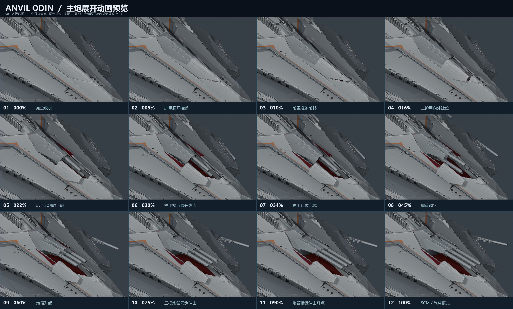
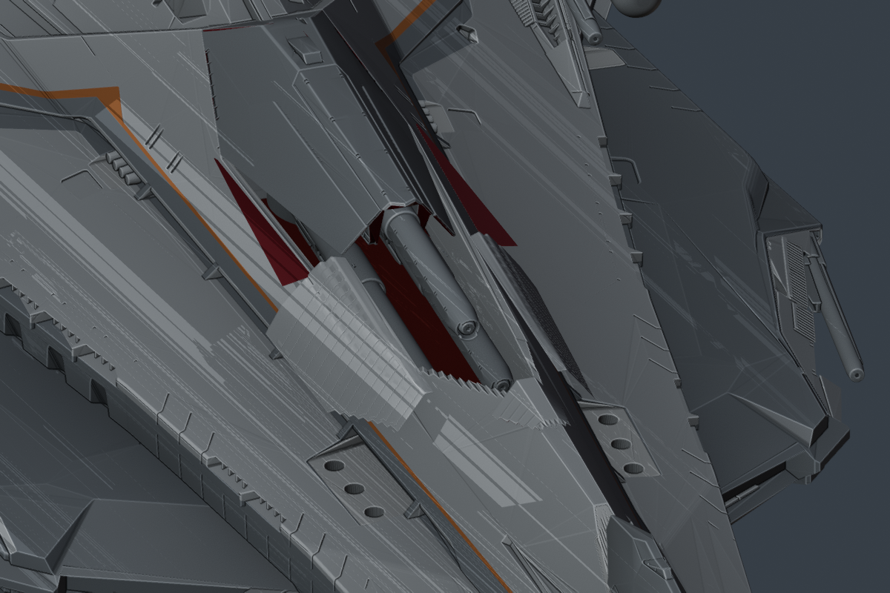
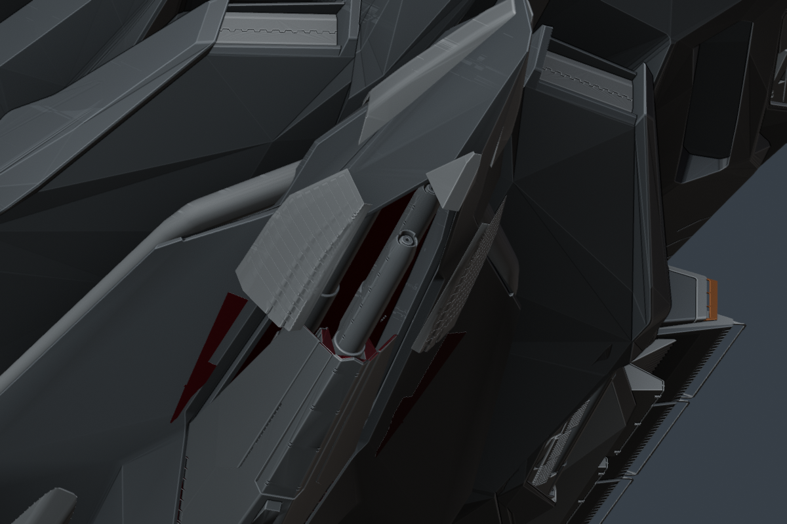

# v0.8.2 斜装甲与炮管收纳预览

这是供用户决定是否采用的候选版本，尚未替换正式网站。

[播放完整展开与收起动画](main-battery-preview.mp4)



## 本次调整

- 背部与腹部主炮后侧的四片小盖板，均改为单一平面的斜装甲，保持一致厚度。边缘沿平面贴合炮塔罩壳和固定船壳，保留原来的约 130° 外翻动作。
- 三套完整炮管组件分别收纳。中炮补偿原承架的大部分下降，靠近顶部盖板；两侧炮管随承架下降并略向内收。炮管、卡箍和后膛一起运动。
- 两侧炮管在调平、离开船壳边缘后再恢复展开间距。保持三根炮管同步伸缩，以及完全展开时的原始几何和位置。
- 保留上一版五片护甲先让位、炮塔后升起的顺序，以及主板较短的平移行程、锯齿接缝和深红色内表面。

原始 `odin.blend` 保持不变，可编辑版本为 `assets/blender/odin_articulated_v0.8.2.blend`。GLB 仅含几何、材质、贴图和静态关节；动作由 Nuxt/Three.js 计算。

## 观察收纳姿态

这两张图停在护甲已让位、炮管尚未升起的时刻，便于观察中炮与两侧炮管的高度差。





## 预览与复现

预览从实际高精度 GLB 读取节点层级，调用 `app/lib/odin-rig.ts` 计算 101 个姿态；Blender 只临时摆放这些姿态并渲染图片，没有保存或导出 Blender 动画。视频使用固定机位和基础材质，便于审查机构，不代表网页最终光照。

```sh
node tools/review_animation_poses.mjs --version 0.8.2
blender -b assets/blender/odin_articulated_v0.8.2.blend --python-exit-code 1 --python tools/render_animation_preview.py -- --version 0.8.2 --width 960 --height 640
python tools/encode_animation_preview.py --version 0.8.2 --ffmpeg /path/to/ffmpeg
python tools/make_animation_sequence.py --version 0.8.2
```

视频包含约 6.5 秒展开、短暂停留、约 6.5 秒收起和短暂停留。十二帧按机构阶段选取，时间间隔不同。文件校验值见 `animation-preview.json`。

## 检查范围

小盖板平面性、护甲与船壳运动间隙、炮管与顶盖及固定船壳间隙分别记录。原模型的后膛、套筒和罩壳内部存在嵌套安装面，报告会保留这些接触及其与上一版的差异；不将它们表述为所有几何零相交。三角网格抽样检查也不等同于连续碰撞或实体装配证明。

最终检查通过：

- `npm test`：21 项；`npm run verify:asset`、`npm run generate` 通过。两份 GLB 均为 140 个静态关节、零动画片段。
- 四片小盖板最大平面误差小于 0.00001 源单位；全程 131 个铰链角度和实际运行姿态检查通过，见 `planar-aft.json`。
- 101 个实际 JS 姿态中的护甲／炮塔、护甲之间与护甲／固定船壳相交均为零，见 `main-clearance.json`、`hull-sweep.json`。
- 炮管外部相交事件为零；中炮收纳时与顶盖采样间隙为背部约 0.503、腹部约 0.573 源单位。内部安装面和既有导轨接触范围另见 `bore-audit-notes.md`、`bore-clearance.json`。
- 原炮管顶点、拓扑、UV、材质及完全展开姿态保持，见 `bore-source-preservation.json`。固定船壳和其余 291 个对象保持，见 `hull-preservation.json`、`unchanged-systems.json`。
- 预览 MP4 的 437 帧完整解码通过；桌面浏览器检查见 `browser-review.json`。
