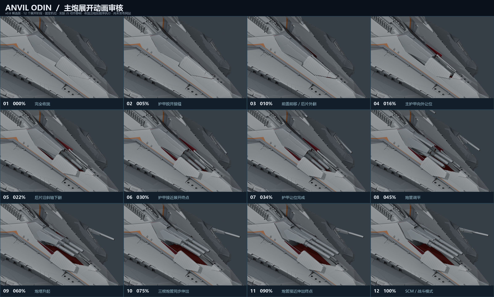

# v0.8 主炮动画审核候选版

本轮只提交模型、Nuxt 动作和十二张静帧，等待用户确认，**不部署网站**。



静帧使用同一个前上方机位，覆盖从 NAV 收拢到 SCM 完全展开的过程。各张图是选定的机构阶段，不是等时间隔。收拢使用相同的连续函数反向执行。

## 本轮变更

- 左、中、右三根原始炮管独立分件，使用同一进度伸缩；中心炮管的 SCM 终点保持原位。
- 两块主板缩短外移与下沉行程，先微量脱开齿口，再平移让位；不改变板的角度。
- 后侧两块独立三角补片沿斜置铰链外翻约 130°。
- 活动护甲内侧改成深红色，外侧保留灰色。前盖按原固定船壳的齿形轮廓重新贴合。
- 所有护甲让位后再调平、升起主炮，最后同步伸出三根炮管。

## 单张原图

| 阶段 | 原图 | 阶段 | 原图 |
| --- | --- | --- | --- |
| 01 完全收拢 | [PNG](frames/frame-01-d0.00.png) | 07 护甲让位完成 | [PNG](frames/frame-07-d0.34.png) |
| 02 脱开接缝 | [PNG](frames/frame-02-d0.05.png) | 08 炮管调平 | [PNG](frames/frame-08-d0.45.png) |
| 03 前盖前移、后片外翻 | [PNG](frames/frame-03-d0.10.png) | 09 炮塔升起 | [PNG](frames/frame-09-d0.60.png) |
| 04 主甲向外让位 | [PNG](frames/frame-04-d0.16.png) | 10 三管同步伸出 | [PNG](frames/frame-10-d0.75.png) |
| 05 后片沿斜轴下翻 | [PNG](frames/frame-05-d0.22.png) | 11 接近伸出终点 | [PNG](frames/frame-11-d0.90.png) |
| 06 接近展开终点 | [PNG](frames/frame-06-d0.30.png) | 12 SCM 战斗模式 | [PNG](frames/frame-12-d1.00.png) |

## 复现与验证

渲染工具读取 `public/models/odin.glb` 的实际静态节点和 `app/lib/odin-rig.ts`，计算姿态后应用到另存的 `assets/blender/odin_articulated_v0.8.0.blend`。渲染过程不保存动画，也不改写 Blender 源文件。此图使用工作台材质和固定光照，重点确认机构轮廓和运动；它不是网页最终光照截图。

```sh
node tools/review_main_sequence_v08.mjs
blender -b assets/blender/odin_articulated_v0.8.0.blend --python tools/render_main_sequence_v08.py
python tools/make_main_sequence_v08.py
```

```sh
npm test
npm run verify:asset
npm run generate
node tools/review_rig_poses.mjs
blender -b assets/blender/odin_articulated_v0.8.0.blend --python-exit-code 1 --python tools/check_main_clearance.py
blender -b assets/blender/odin_articulated_v0.8.0.blend --python-exit-code 1 --python tools/check_main_hull_sweep_v08.py
blender -b --python-exit-code 1 --python tools/verify_fixed_hull.py -- 0.8.0
```

检测覆盖上下主炮的十片护甲、炮管、炮罩、炮座及固定船壳，使用 101 个实际 JS 姿态。抽样三角网格检测用于发现穿模，不能替代对最终视觉和概念吻合度的人工确认。原始 `odin.blend` 未修改，两档 GLB 均不含动画片段。

本候选版本结果：20 项测试通过；高、低画质资产验证与 Nuxt 静态构建通过。本地浏览器已核对高画质模型加载、SCM 展开和主动暂停保持，控制台无警告或错误。双联副炮、四联炮、PDC、单联炮护罩、舰桥护甲和尾门另做了闭合／展开静帧复查。

- [101 姿态护甲／炮塔和护甲之间的相交检测](main-clearance.json)：每姿态 30 对，零命中。
- [101 姿态护甲／固定船壳扫掠](hull-sweep.json)：每姿态 10 片，零命中。
- [后侧四片护甲 0–130°逐度检测](aft-fit.json)：零船壳相交，展开自由边均向外移动。
- [固定船壳原始坐标、拓扑、变换比较](hull-preservation.json)：完全一致。
- [静帧、模型及动作源码校验值](review-manifest.json)。
