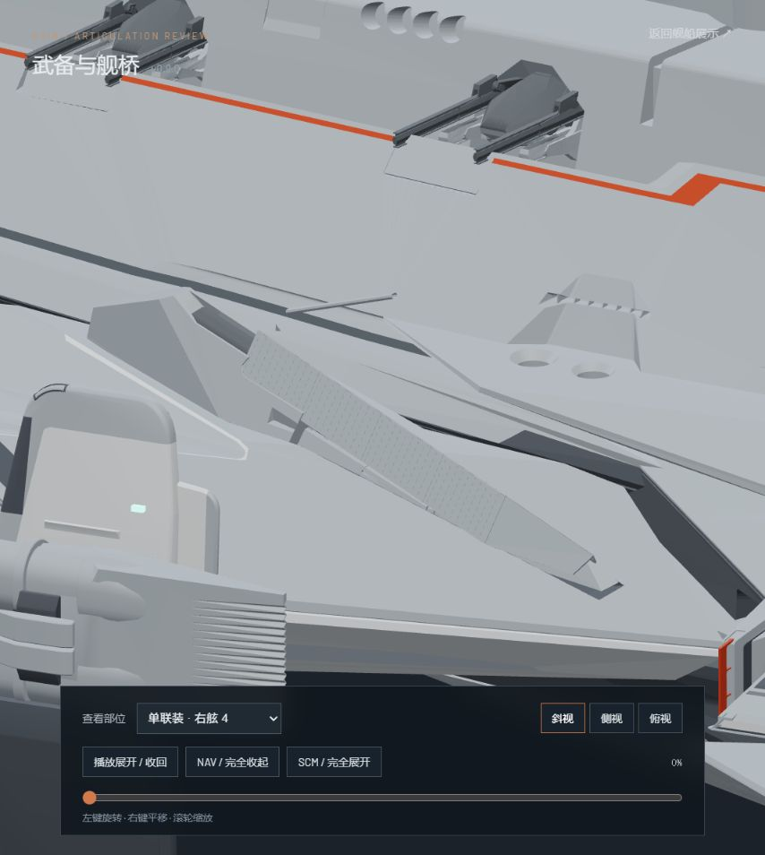
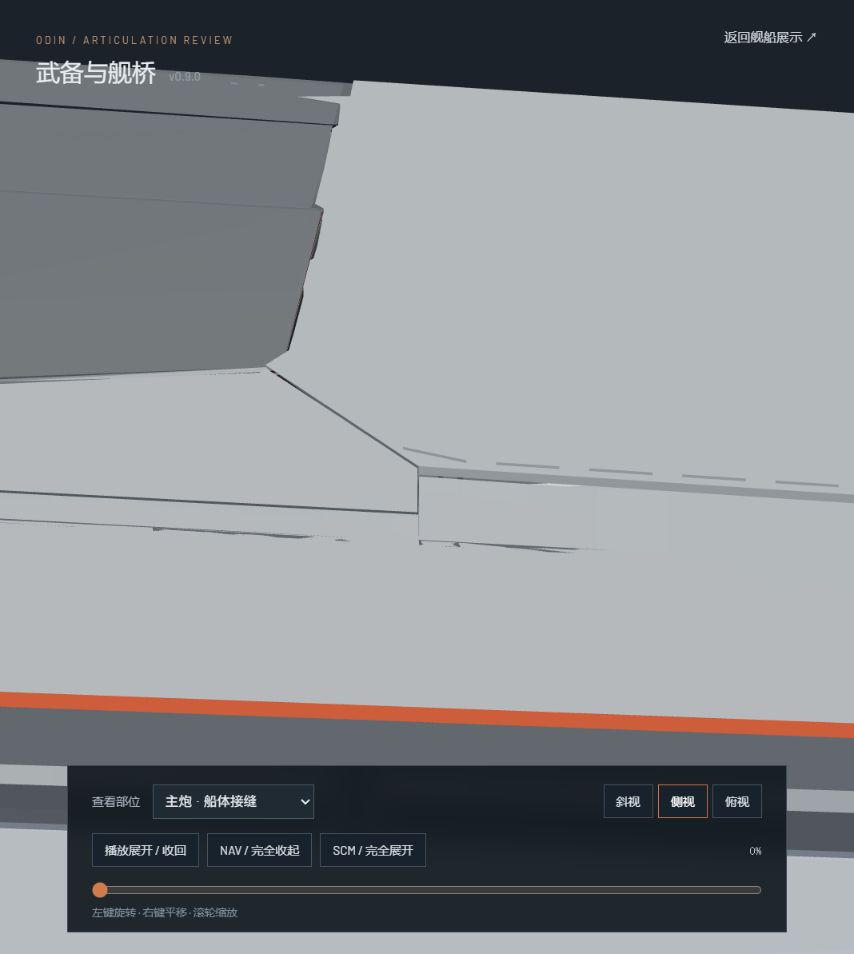
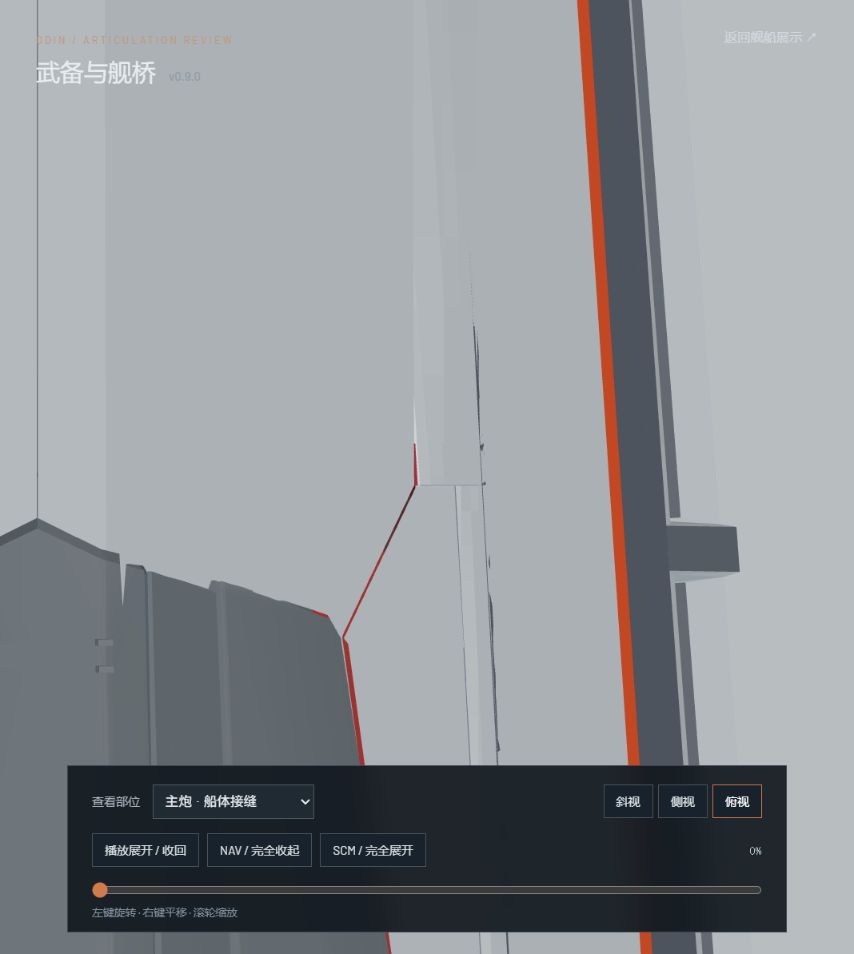
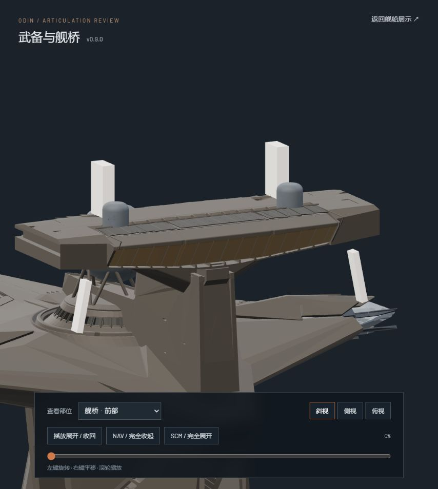

# v0.9.0-rc.1 — 副炮、舰桥及主炮固定船壳接缝

本轮为本地审核候选，不部署公网。预览使用和首页相同的高精度 GLB、Nuxt 及 `createOdinRig`，动画由 JavaScript 实时计算。

- 本机预览：<http://127.0.0.1:4173/?review=secondary>
- 通常开发启动后：<http://127.0.0.1:3000/?review=secondary>
- 查看部位菜单包含全部 11 座单联装、2 座四联装、8 座双联装、舰桥前后和主炮接缝；可播放、逐位置拖动、切换斜视/侧视/俯视。
- 左键旋转、右键平移、滚轮缩放。

## 变更

单联装盖板按原有通道、轴承和前端斜面重新连接，闭合为连续的三角护罩。耳轴沿实际炮轴前移 7.5 个模型单位；11 座单联装只作俯仰，不作巡转。舰艏炮根的运动护罩保持原始收拢姿态。

四联装的每根炮管与固定根部护甲分离，八片根部护甲留在支架上，缩短套筒行程。八座双联装依据各自的炮轴计算俯仰，完全展开后仰角约 6°、方位各异；舰艉四座的船壳缺口增加独立盖板，先降盖板再移出炮塔。

舰桥前部护甲先脱开、外翻，再沿顶轨收纳；后部真正的窗面护甲从原船壳中分离为上下两组，保留固定导向件。增加前部导轨及联动横梁，舰桥使用暖炭灰外壳与茶金色窗面。

主炮旁固定船壳延续相邻外壳平面，取消独立直立补片；外侧填平，内侧保留沿斜铰链的避让槽。主炮机构的动画曲线保持 v0.8.11 行为。

## 验证

- `npm test`：27/27 通过，包括主动暂停、拖动状态、主炮连续运动、单联装无巡转、8 座双联装朝向及盖板次序。
- `npm run verify:asset`：高低两档 GLB 通过；197 个合批网格、208 个静态关节、零动画片段。
- `npm run generate`：通过。
- 主炮 10 块护甲与固定船壳：101 个实际 JS 姿态，0 相交事件，见 `hull-sweep.json`。
- 舰桥 45 块护甲与船壳/固定窗面：21 个实际 JS 姿态检查，未检测到相交。
- 网页检查覆盖 11 座单联装的左右朝向与收放端点、四联装根部、8 座双联装、4 个缺口盖板、舰桥前后，以及主炮接缝侧视与俯视。

三角网格相交诊断是有限采样。完全收起时，舰腹单联装和左右舷第 2、4 座单联装仍报告炮管模型与护罩隐藏内面的接触；从 10% 展开起，11 座单联装与自身护罩的采样相交均为零。原模型还包含嵌入式轴承等内部接触，不能据此声称整舰机械结构完全无接触，详见 `secondary-audit.json`。此候选供外观和动作审核，不是官方生产资产。

原始 `odin.blend` 未改动，SHA-256：`9ec8b6ee36e6315c7c0cae8576472879518cc5bf48b79382c2affbcbd71af15e`。修改后的可编辑模型为 `assets/blender/odin_articulated_v0.9.0.blend`。

## 网页截图

参考：[官方四联装视频](https://media.robertsspaceindustries.com/meqm0flrf1683/mp4_640.mp4)、[奥丁官方介绍](https://robertsspaceindustries.com/en/comm-link/transmission/21133-Anvil-Odin)。
